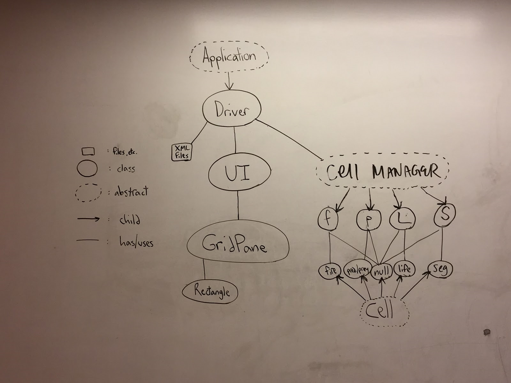
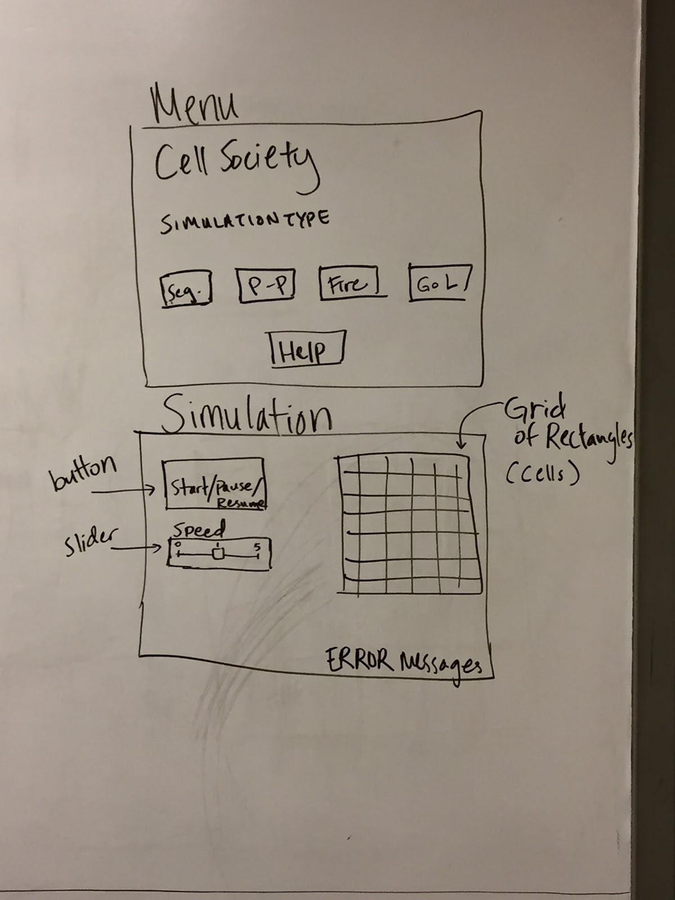

CompSci 308: Cell Society Design Document
===================

Introduction
=======

### Problem
We want to create a Cellular Automata simulator that can run different simulations, which include cells of different states and a set of rules that determine how a cell’s state changes based on the states of its neighboring cells.


### Design Goals
Our goals for this design are to present a simple interface for users to run built-in cell automata simulations, and to make the program flexible enough so that new simulations can be easily added by other programmers


### Design Architecture
_Closed_ - the driver of the program, the element that handles UI, and abstract superclasses for the cells and simulation


_Open_ - the addition of cell types and simulations (subclasses of the abstract superclasses Cell and CellManager, respectively)


Overview
=======


Our design is driven by a class Driver that delegates the visual component responsibilities to a UI class, which contains a GridPane and other visual components, and the back-end responsibilities to a subclass of CellManager, which uses a subclass of Cell for the simulations computations. Driver runs a game-loop-esque procedure and a step method that continuously updates the simulation. In a given call, the step method uses a subclass of CellManager that corresponds with the type of simulation. This subclass updates the statuses of each Cell and returns the list of updated Cells to Driver. The step method then passes the list of updated Cells to UI, which uses the list to update the colors of the Rectangles in the GridPane.


User Interface
========


We will have a menu that will display on startup and have buttons for the various simulations. When any of these buttons are pressed the scene will change to show that simulation’s user interface.  There will also be a help button that displays all the information about each simulation and how the XML files are formatted.
On each simulation’s interface, we will include:


* The type of the simulation displayed in the title of the stage.
We will insert a button for starting button “START” that switches to “PAUSE” when running and switches to “RESUME” if paused and already started.

* Another button for moving the animation step by step (one animation at a time).

* Another button for switching back to the menu may need to be included if a new stage isn’t made for each simulation. This can be located in the top right corner (not included in picture).

* There will also be a slider to choose the speed at which the animation is updated.

* There will also be a brief introduction about what the simulation is of (maybe bottom left corner, also is not included in picture).

* At the bottom of the scene, we will report any errors in red.


We also have considered on the user interface side, using various windows (stages) instead of just transitioning between scenes to show the various simulations. The menu stage would remain open as long as the program is running. Each button clicked on the menu would then create a new window (stage) for that simulation. This would allow users to compare simulations side by side. NOTE: our methods in Design Details does not reflect this feature.

It would also be nice to be able to dynamically scale the simulation stage/scenes based on the size of the cellular automata specified in the XML file.


Design Details
=======

### Classes

##### Driver.java (extends Application)

This class is the main class for the program. It reads in and parses XML files, starts the program, and handles the simulation loop. 

The driver communicates with the UI and Cell Manager classes by directly passing information about the simulation and cells.


INSTANCE VARIABLES:
```java
Stage myStage
Scene myScene
Group root
CellManager simType
UI display
int fps
int gridSize
ArrayList<Color> cellStatuses
```


METHODS:
```java
/**
* Reads xmlFile and sets simType, gridSize, and cellStatuses * instance variables
* Creates instances of CellManager and UI
*/
private void readAndSet(File xmlFile)

/**
* Starts the application
* Calls UI to create the Menu
*/
public void start(Stage stage)

/**
* Runs the “gameLoop” and calls step
*/
public void simLoop()

/**
* Continuously updates the simulation 
* Interacts with CellManageer to update the statuses of
* cells and UI to update the color displays
*/
private void step(double elapsedTime, ArrayList<Color> cellStatuses)
```


##### UI.java

The UI class manages all of the visual components of the program, displaying the grid and its cells as they change states, the parameters available to be toggled by the user, and other stylistic and textual components.


INSTANCE VARIABLES:
```java
double animationSpeed
boolean start
boolean running
ArrayList<Button> buttons
GridPane grid
```


METHODS:
```java
/**
* Sets up the Menu and waits for users to interact with it
* through handleButtonClick to move to setSim
*/
public void setMenu(Stage stage, ArrayList<Button> buttons)

/**
* Sets up the simulation and waits for user interaction
* button press) to move to the simLoop
*/
private void setSim(Stage stage)

/**
* Sets the Color of each child of grid as the corresponding * Color in newColors
*/
public void updateCellColors(ArrayList<Color> newColors)

/**
* Handles mouse event when button is clicked
* Causes the transition between setMenu and setSim
*/
private void handleButtonClick(Button button)
```


##### CellManager.java

This class holds all of the Cells in the simulation and manages all of the operations necessary to update their statuses.


INSTANCE VARIABLES:
```java
	ArrayList<Cell> currentCells
	ArrayList<String> nextCellStatuses
```

	
METHODS:
```java
/**
* Returns an int array of the locations of neighbor cells
*/
public int[] getNeighborLocationNums(Cell c)

/**
* Sets nextCellStatuses by getting the next status of each 
* cell in currentCells and adding it to nextCellStatuses
*/
public void setNextCellStatuses()

/**
* Sets the status of each cell in currentCells to each 
* corresponding status in nextCellStatuses
*/
public void updateCurrentCells()

/**
* Returns arraylist of all neighboring cells
*/
private ArrayList<Cell> getNeighbors(int[] locationNums)
```


SUBCLASSES:

FireSim.java, WatorSim.java, LifeSim.java, PredatorPreySim.java, SegregationSim.java


##### Cell.java


INSTANCE VARIABLES:
```java
	String status
	Color color
```


METHODS:
```java
/**
* Gets the current cell status
*/
	public String getStatus()

/**
* Sets the current cell status; also changes cell’s color
* status <--> color
*/
	public void setStatus()
```
	
	
SUBCLASSES:

FireCell.java, WatorCell.java, LifeCell.java, PredatorPreyCell.java, SegregationCell.java, NullCell.java


### Use Cases
(also explained in detail throughout the DESIGN.md file)


The getting neighbors functions will be the same for each of the edge/corner and middle cases. This could be done in two ways: the grid could be set up initially to make this easier (filling it with a border of null cells) or those cells could be taken care of separately when getting neighbors. We decided that the grid will be wrapped in a border of null Cells, on which the get-neighbors function is never called, so as to make getting the neighbors of an edge cell the same process as getting the neighbors of a middle cell. We also decided that getting neighbors should always return all of the neighbors (which will be a constant 4 or 8 depending on the type of cellular automata, von Neumann vs. Moore neighborhood) and that the edge cases should just include null cells (making get neighbors pretty and just requiring a little bit more setup). This does make us “expand” our grid by a little, but we think it will make debugging and testing our code easier (constant length of all the neighbors returned). For a specific cell, we will access its location in the currentCells arraylist and use getNeighborLocationNums to get those neighboring cells. This will just be done by taking the cells at the indices +/-1 from the current index (the ones right and left of the current cell), and +/-(Math.pow(currentCells.size(),0.5)) (the ones below and above the current cell).

In order to move to the next generation of a simulation, the step method of Driver calls on a CellManager subclass to update the statuses of the Cells and pass the newly updated Cells back to Driver in a list. The step method then passes this list to the UI object, which updates the Colors of all the Rectangles in the GridPane accordingly.

In order to set the value of a simulation parameter such as probCatch in Fire, Driver reads the value to set from the XML file and calls a setParameter method of the CellManager subclass that it uses to run the simulation.

To switch simulations, we will need to click the menu button to get from the Game of Life simulation scene to the menu scene. Then a button must be pressed on the menu scene to switch to the Wator simulation. We mostly know how we would code this way. An alternative, that is also mentioned earlier in the User Interface section, is using new stages/windows to hold the various simulations which would make switching between animation simulations easier and allow for comparison.


Design Considerations
=======

One thing that we addressed was how to get neighbors (on top of just the edge vs middle cases, see Use Cases under Design Details). These are our preliminary ideas, but are definitely subject to change if we find a better method.

We discussed the pros and cons of having each individual cell “know” their location and how we would keep this location information. We were first thinking about having a superclass contain all of the location information, but then there would be a large amount of code to just try and get a specific cell’s location. Instead we thought that the cell should intrinsically know its location by having it be in an “order” defined by the XML file and how it is read. Thus, a Cell’s index in the list in which it is contained in CellManager indicates its location. Therefore, we will reduce the amount of code and can easily access this location without an instance variable (int location) in Cells.

Then we had to consider how we wanted this location to be formatted. We could use Point2D row and columns, which would involve getting the x and y locations (extra methods and code) and take a good amount of space. There would also have to be some math (adding/subtracting one to the row and column) needed to find the locations of the other neighbors. On the other hand, if we kept each location as just an integer, this would take up less space and also need a similar amount of math to find the locations of its neighbors (adding/subtracting one/size of grid). Thus, each Cell’s location is an integer with the top left corner Cell being 1 and each location incrementing left to right along each row.

We also discussed at length how we wanted to display our simulations. We debated whether or not the Driver should have a GridPane that handles Cell formatting while the Driver handles the rest of the UI, and we concluded that it would be best to streamline all of the UI components in a single UI class used by Driver. This is more efficient and cleaner than dispersing the UI components throughout the Driver class.


Team Responsibilities
=======
### Aaron

* PRIMARY mostly backend, writing CellManager and Cell abstract superclasses, writing code for the two simulations (CellManager and Cell subclasses)

* SECONDARY finishing incomplete code for other simulations


### Dara

* PRIMARY formatting and reading XML and learning what XML is, starting code for one simulation (the two subclasses of CellManager and Cell)

* SECONDARY helping with UI


### Kelly

* PRIMARY figuring out UI display updating things, starting code for one simulation (the two subclasses of CellManager and Cell)

* SECONDARY helping format XMLs, and working on Driver class

